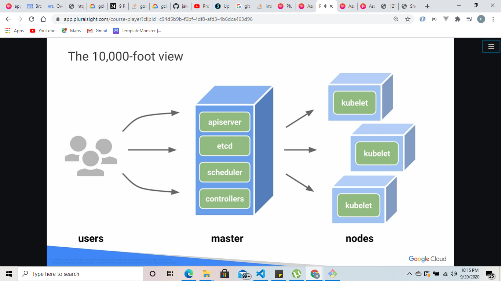

# KUBERNETES BASICS DEFINITION
    . This container ochestration system that allows you to specify how many containers you want to run

<!-- 

 -->

# A POD 

    image here

    A pod is analogous to a vm with a group of containers sharing networking and storage that are seprate from the node 

####    you can define a pod with yaml

picture 

#### A pod file is composed of several parts; for example

    1 API version
    2 pod resource
    3 pod name
    4 two containers 
    5 the front end
    6 how replicas needed

#### 

# KUBERNETES

- [X] Provision a Kubernetes cluster using Google Kubernetes Engine.

- [X] Deploy and manage Docker containers using kubectl.

- [X] Split an application into microservices using Kubernetes' Deployments and Services.

    You use Kubernetes Engine and its Kubernetes API to deploy, manage, and upgrade applications. You use an example application called "app" to complete the labs.

##   Get the sample code from the Git repository.

        git clone https://github.com/googlecodelabs/orchestrate-with-kubernetes.git

        cd orchestrate-with-kubernetes/kubernetes
        ls
        the Output will look this

| deployments/ |  Deployment manifests |
|--------------|-----------------------|
| nginx/       | nginx config files    |
| pods/        | pod manifests         |
| tls/         |  TLS certificates     |
| cleanup.sh   | Cleanup script        |

## Start a Kubernetes cluster

_Make sure that kubernetes engine api is enable_

#### Define your zone as a project default zone. This way you do not need to specify --zone parameter in gcloud commands.

        gcloud config set compute/zone us-central1-a

####  In Cloud Shell, run the following command to start a Kubernetes cluster called bootcamp that runs 5 nodes.

        gcloud container clusters create bootcamp --num-nodes 5 --scopes "https://www.googleapis.com/auth/projecthosting,storage-rw"

        or

        gcloud container clusters create gk-cluster --num-nodes=4

#### After the cluster is created, check your installed version of Kubernetes using the kubectl version command.

      
        kubectl version

_The gcloud container clusters create command automatically authenticated kubectl for you._

#### Use kubectl cluster-info to find out more about the cluster.

        kubectl cluster-info

#### Bash Completion 
_Kubernetes comes with auto-completion. You can use the kubectl completion command and the built-in source command to set this up._

_Run this command._

        source <(kubectl completion bash)

Step 2

        Press Tab to display a list of available commands.

###### Try the following examples:

        kubectl <TAB><TAB>

You can also complete a partial command.

## Run and deploy a container
#### The easiest way to get started with Kubernetes is to use the kubectl create deployment command.

#### Use kubectl create deployment to launch a single instance of the nginx container.

        kubectl create deployment nginx --image=nginx:1.10.0

#### In Kubernetes, all containers run in pods. And in this command, Kubernetes created what is called a deployment behind the scenes, and runs a single pod with the nginx container in it. A deployment keeps a given number of pods up and running even when the nodes they run on fail. In this case, you run the default number of pods, which is 1.

#### Use the kubectl get pods command to view the pod running the nginx container.

        kubectl get pods

####   Use the kubectl expose command to expose the nginx container outside Kubernetes.

        kubectl expose deployment nginx --port 80 --type LoadBalancer

_Kubernetes created a service and an external load balancer with a public IP address attached to it (you will learn about services later). The IP address remains the same for the life of the service. Any client who hits that public IP address (for example an end user or another container) is routed to pods behind the service. In this case, that would be the nginx pod._

#### Use the kubectl get command to view the new service.

        kubectl get services

_You'll see an external IP that you can use to test and contact the nginx container remotely._
_It may take a few seconds before the ExternalIP field is populated for your service. This is normal—just re-run the kubectl get services command every few seconds until the field is populated._

#### Use the kubectl scale command to scale up the number of backend applications (pods) running on your service using.

        kubectl scale deployment nginx --replicas 3

_This is useful when you want to increase workload for a web application that is becoming more popular._

            

